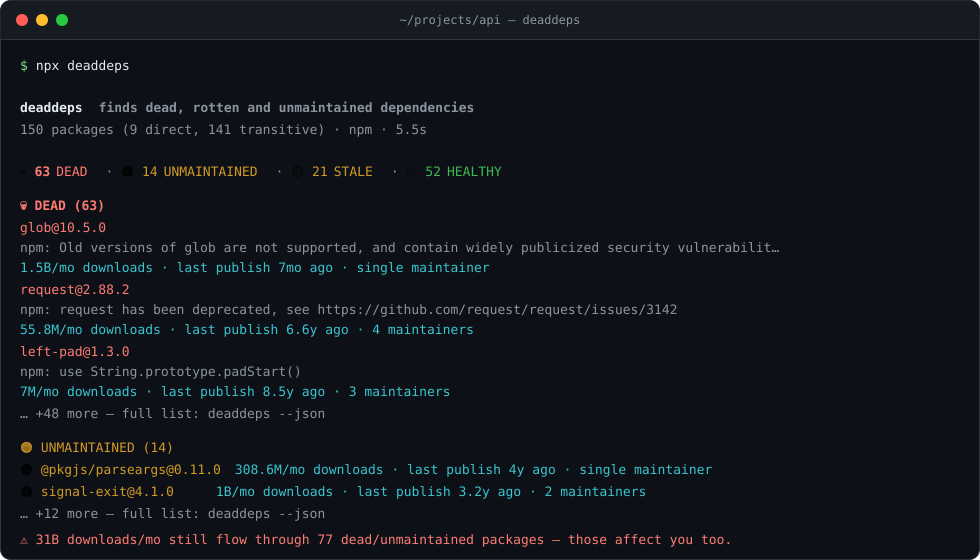

# deaddeps

[](https://github.com/RetroNyym/deaddeps/actions/workflows/ci.yml)
[](https://www.npmjs.com/package/deaddeps)
[](https://www.npmjs.com/package/deaddeps)
[](./LICENSE)

**Find dead, unmaintained and stale dependencies before they find you.**

Zero dependencies. No API keys. npm, PyPI and crates.io.

```
$ npx deaddeps

deaddeps  finds dead, rotten and unmaintained dependencies
150 packages  (9 direct, 141 transitive)  ·  npm  ·  5.5s

  💀 63 DEAD   ·   🟠 14 UNMAINTAINED   ·   🟡 21 STALE   ·   ✅ 52 HEALTHY

💀 DEAD (63)
  glob@10.5.0
    npm: Old versions of glob are not supported, and contain widely publicized security vulnerabilit…
    1.5B/mo downloads  ·  last publish 7mo ago  ·  single maintainer
  request@2.88.2
    npm: request has been deprecated, see https://github.com/request/request/issues/3142
    55.8M/mo downloads  ·  last publish 6.6y ago  ·  4 maintainers
  left-pad@1.3.0
    npm: use String.prototype.padStart()
    7M/mo downloads  ·  last publish 8.5y ago  ·  3 maintainers
    …
    … +48 more — full list: deaddeps --json

  ⚠ 31B downloads/mo still flow through 77 dead/unmaintained packages — those affect you too.

  next: npm audit  ·  npm outdated  ·  in CI: deaddeps --fail-on dead
```



---

## Why another dependency tool?

| Tool | Answers |
| --- | --- |
| `npm audit` | "Which packages have **known vulnerabilities**?" |
| `npm outdated` | "Which packages have a **newer version**?" |
| **`deaddeps`** | "Which packages is **nobody maintaining anymore**?" |

These are different questions, and the third one has no good default answer.

A package can have **zero vulnerabilities** and **no newer version**, and still be a
landmine: the maintainer left in 2019, there is one bus-factor away from silence, and
the next supply-chain attack will go through it because nobody is reading the diffs
anymore. `npm audit` will not warn you — there is no CVE for "abandoned".

`deaddeps` reads your **lockfile**, not just your `package.json`, because the vast
majority of what you install is transitive: a package you never chose, from a
maintainer you have never heard of.

## Install

```bash
npx deaddeps            # no install, no config, no API key
```

or globally:

```bash
npm install -g deaddeps
```

Requires Node 18.17+. **Zero runtime dependencies** — the whole tool is ~2000 lines
of Node standard library. Check `npm ls --omit=dev` on this repo: it is empty.

## Usage

```bash
deaddeps                     # scan the current directory
deaddeps ./api               # scan a specific directory
deaddeps --direct            # only the packages you wrote yourself
deaddeps --json > report.json
deaddeps --compact           # one line, for CI logs
deaddeps --show-healthy      # list the healthy ones too
deaddeps --fail-on dead      # exit 1 if anything is dead (CI gate)
deaddeps --min-score 40      # exit 1 if any package scores below 40
deaddeps --no-cache          # ignore the disk cache
```

| Flag | Meaning |
| --- | --- |
| `--direct` | Skip transitive dependencies (scan `package.json` / `Cargo.toml` / `pyproject.toml` only) |
| `--json` | Machine-readable report, all packages, no truncation |
| `--compact` | Single summary line for CI logs and Slack |
| `--show-healthy` | Include healthy packages in the text report |
| `--fail-on <level>` | `dead` \| `unmaintained` \| `stale` \| `any` — exit code 1 when crossed |
| `--min-score <n>` | Exit code 1 when any package scores below `n` (0–100) |
| `--concurrency <n>` | Parallel requests (default 16) |
| `--cache-ttl <days>` | Disk cache lifetime (default 7, `0` = off) |
| `--no-cache` | Do not read or write the disk cache |
| `--verbose` | Show the progress line even when stderr is not a TTY |

**Exit codes:** `0` clean · `1` threshold crossed · `2` usage or runtime error.

### CI

```yaml
# .github/workflows/deaddeps.yml
name: deaddeps
on: [push, pull_request]
jobs:
  deaddeps:
    runs-on: ubuntu-latest
    steps:
      - uses: actions/checkout@v4
      - uses: actions/setup-node@v4
        with:
          node-version: 20
      - run: npx deaddeps --fail-on dead --compact
```

## Statuses

Thresholds are exact and identical in `src/score.js`, this table and the tests
(`test/score.test.js`).

| Status | Rule |
| --- | --- |
| 💀 **DEAD** | Publisher marked it `deprecated`, **or** no release in **> 4 years** |
| 🟠 **UNMAINTAINED** | No release in **> 2 years** |
| 🟡 **STALE** | No release in **> 1 year** |
| ✅ **HEALTHY** | Released within the last year |
| ❓ **UNKNOWN** | The registry would not tell us (private package, network, typo) |

A "release" means **the latest release of the package** — is anyone still maintaining it?
Not the version pinned in your lockfile: if `debug` shipped a new release last month but
you are pinned two majors behind, that is `npm outdated`'s job, not this tool's.

The version you actually have installed is still used for two things:

- it is the version shown in the report (`glob@10.5.0`, not `glob@11.0.0`);
- npm marks **individual versions** as `deprecated`, not whole packages. If your pinned
  version says "don't use this" while the latest one is fine, that counts — see
  `glob@10.5.0` and `uuid@3.4.0` above, both caught this way. PyPI `yanked` and
  crates.io `yanked` work exactly the same way: flagged only when **your** version is
  the bad one.

## Score (0–100, higher is healthier)

Statuses are a strict ladder used for CI gates. The score is only for **ranking** the
report and for `--min-score`. It starts at 100 and loses points:

| Signal | Penalty |
| --- | --- |
| `deprecated` by the publisher | → **0**, nothing else matters |
| last release > 5 years ago | −60 |
| last release > 3 years ago | −45 |
| last release > 2 years ago | −30 |
| last release > 1 year ago | −15 |
| last release > 6 months ago | −5 |
| publish date unknown | −20 |
| 0 maintainers | −30 |
| 1 maintainer | −10 |
| 2 maintainers | −3 |
| no repository link | −5 |

Why maintainer count: it is the **bus factor**. `lodash` with 7 maintainers and a
package with one volunteer in a spare bedroom are not the same risk, even if both
were released last month.

Every penalty above is one line of code in `src/score.js`. If you disagree with the
weighting, you can read it in 30 seconds and tell me exactly which line.

## What it reads

| Ecosystem | Manifests | Lockfiles |
| --- | --- | --- |
| npm | `package.json` | `package-lock.json` (v1/v2/v3), `npm-shrinkwrap.json`, `yarn.lock` (v1 + berry), `pnpm-lock.yaml` |
| PyPI | `requirements*.txt`, `pyproject.toml` (PEP 621 + Poetry) | — |
| Rust | `Cargo.toml` | `Cargo.lock` |

Monorepos are supported: every manifest under the target directory (5 levels deep,
`node_modules`, `.git`, `dist` etc. are skipped) is merged into one report.

**Public data sources** — no keys, no accounts, no telemetry:

- `registry.npmjs.org` — package metadata, maintainer counts, `deprecated` messages
- `api.deps.dev` (Google) — authoritative publish timestamps, per-version deprecation
- `api.npmjs.org` — monthly download counts, **in bulk** (up to 90 packages per
  request, so a 150-package scan costs 2 requests, not 150)
- `pypi.org` — package metadata, yanked releases
- `pypistats.org` — PyPI download counts (community service, used politely: only for
  packages that already look unhealthy)
- `crates.io` — package metadata, yanked releases, download counts

Results are cached on disk for 7 days (`~/.cache/deaddeps` on Linux,
`%LOCALAPPDATA%\deaddeps` on Windows), so a second run is nearly instant.

## Honest limitations

Read this before you trust the output.

- **"No release in 4 years" ≠ "broken".** Some packages are finished — `left-pad`
  has no bugs to fix. Treat DEAD as *"look at it"*, not *"delete it now"*. The
  download count next to each name is there to tell those two cases apart: 7M/month
  means people still depend on it, 0/month means you probably can drop it.
- **A green status is not a security statement.** Use `npm audit` for CVEs. This
  tool tells you about maintenance, not vulnerabilities. You want both.
- **Download counts come from three different places and mean slightly
  different things.** npm's number is a true last-30-days count, fetched in
  **bulk** (one request per 90 packages) — asking package by package hits
  Cloudflare's 429 wall after roughly 40–50 requests, which I measured before
  finding the bulk endpoint. PyPI has no official count, so `pypistats.org` is
  used, and only for packages that already look unhealthy (it is a community
  service; hammering it with 150 requests would be rude). crates.io reports a
  rolling 90-day number, divided by 3 here. Numbers are shown when they exist
  and omitted when they don't — never guessed.
- **`dependents` is always `null`.** I had a nice "how many packages depend on
  this" number from the npm search index, and then npm rate-limited it into
  uselessness (measured: 9/30 successful requests at a 50ms interval). I removed
  the field rather than ship a number I could not reliably fetch.
- **Private and scoped packages** that the public registry cannot see come back as
  UNKNOWN. That is the honest answer, not a failure.
- **Publish date ≠ maintenance date.** A package can be actively maintained on a
  branch and never release. There is no public signal for that.

## API

```js
import { scan } from 'deaddeps';

const { rows, meta } = await scan({ root: process.cwd(), directOnly: false });
// rows: [{ name, status, score, lastPublishDays, downloadsMonthly, reasons, ... }]
```

`scan()` is side-effecting only in the network + disk cache; everything else
(`src/score.js`, `src/parse/*`) is pure and testable in isolation.

## Development

```bash
npm test          # node --test, no test framework, no devDependencies
npm start -- .    # run against the current directory
```

The project has no dependencies and no build step. `bin/deaddeps.js` runs the source
directly.

CI runs `npm test` plus a self-scan on Ubuntu and Windows across Node 18, 20 and 22
(`.github/workflows/ci.yml`). Releases are cut by publishing a GitHub Release; the
`publish.yml` workflow then publishes through **npm trusted publishing (OIDC)**, so no
long-lived token exists in this repository.

Contributions welcome — see [CONTRIBUTING.md](CONTRIBUTING.md) for the ground rules
(the important one: zero dependencies stays zero) and [SECURITY.md](SECURITY.md) for
private vulnerability reporting.

## License

MIT
